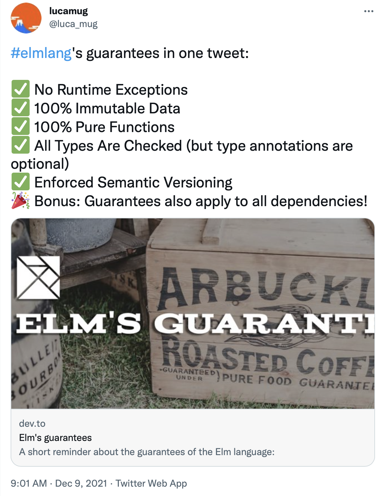
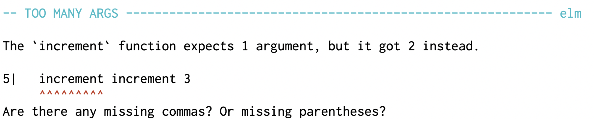
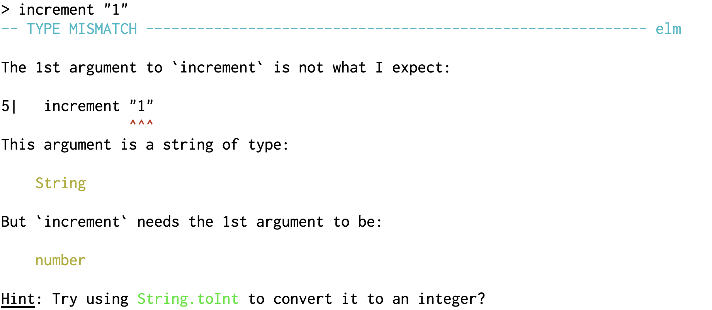
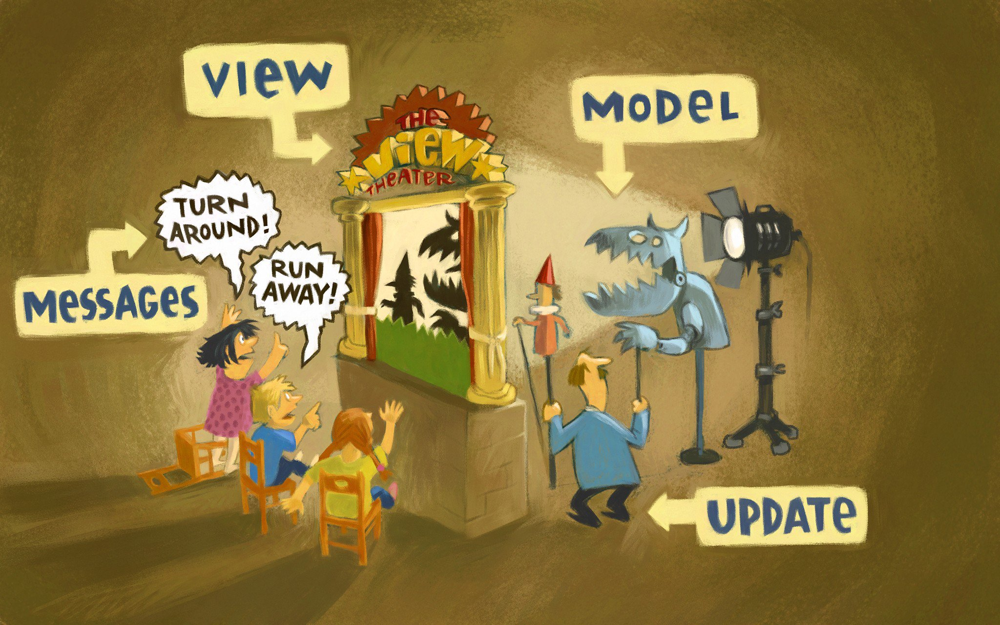
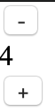

# Elm Workshop

### Dag 1

---

# Plan for dagen

* Snakke om syntax og semantikk
* Lage spill
* Snakke syntax, semantikk og arkitektur
* Fortsette med å lage spill


---

# Hvorfor Elm?

* Hva kan du gjøre?
* Hva kan du _ikke_ gjøre?

---

# Du kan ikke bruke `null`

^Heller ikke undefined. Nevn TS og Kotlin 

---

# Du kan ikke bruke exceptions

^Exceptions er en komplisert kontrollflyt og Elm har bedre måter å håndtere feil.

---

# Du kan ikke endre/mutere ting

^Når noe skal oppdateres lager man en kopi av objektet med noen nye verdier.

^I andre språk kan du for eksempel oppdatere objekt-properties direkte.

---

# Du kan ikke gjøre nettverkskall hvor og når du vil

^Det er et sterkt skille mellom kode som kan/ikke kan gjøre sideeffekte. Dette komm vi tilbake til når vi skal snakke om Elm-arkitekturen.

---

## Mye lettere å forstå hva koden faktisk gjør

^Siden resultatet av en funksjon kun er basert på input til funksjonen er det lett å forstå hva som skjer. Av samme grunn er det enklere å skrive tester.

---

# Typesikkerhet og rubusthet

^Elm har et sterkere typesystem enn mange andre språk. For eksempel ingen støtte for casting, som man kan i TS & co.

^ "75 % av frontend-bugs i Jira er feil som ikke kan skje med Elm" (Aksel)

---

# Stabilt språk

^ Unngå "js-fatigue". Ting skjer i miljøet, men selve språket er veldig stabilt (slipper å holde seg oppdatert på syntax).

---

## Enkelt å refaktorere, enkelt å vedlikeholde

---

# Enkelt å debugge

Innebygget time traveling debugger

^(vis demo i UTV/kjøretøy)

---



---

# Syntax

---

# Verdier
[.column]
```elm
-- Elm
volum = 11
```
[.column]
```js
// JavaScript:
const volum = 11;
```
^Alle verdier er immutable. Ikke noe behov for et keyword foran (const, var). Alle variabler har samme scoping-regler til forksjell fra JS.

---

# Flere verdier

```elm
volum = 11

pi = 3.14

kultProsjekt = "Statens Vegvesen"

detErHelg = False
```

---

# Funksjoner

[.column]
```elm
-- Elm:
increment x =
    x + 1
    
four = increment 3
```

[.column]
```javascript
// JavaScript:
function increment(x) {
    return x + 1;
};
    
const four = increment(3);
```
^ Her ser vi at vi binder resultatet av å kalle increment med argumentet 3, til navnet four

^ Heller ikke når man kaller funksjoner i Elm behøver man parenteser rundt argumenter. Man bare skriver navnet på funksjonen så argumentene

---
# Funksjoner & typeinferens

[.column]
```elm
-- Elm:
increment x =
    x + 1
    
five = increment (increment 3)
```

[.column]
```javascript
// JavaScript:
function increment(x) {
    return x + 1;
};
    
const five = increment(increment(3));
```

^ Hvis vi derimot skal sende med resultatet av et funksjonskall som argumentet til en funksjon, da trenger vi parenteser.

^ For hvis vi bare hadde skrevet increment increment 3, uten parenteser, så hadde vi fått denne feilmeldingen.

--- 



^ *Les hele høyt*

^ Altså må vi putte på parenteser for å gjøre det tydelig hva som er argumentene til hvilke funksjoner.

---

# Funksjoner & typeinferens

[.column]
```elm

-- Elm:
increment x =
    x + 1
    
five = increment (increment 3)
```

[.column]
```javascript
// JavaScript:
function increment(x) {
    return x + 1;
};
    
const five  = increment(increment(3));
```

^ Så i dette tilfellet er det sånn her vi må kalle funksjonene

^ increment (increment 3)

---




^ Og når vi snakker om feilmeldinger, så så dere kanskje at Elm hadde ganske fine feilmeldinger. Kompilatoren foreslo til og med at vi kanskje måtte legge på parenteser.

^ Og feilmeldingene er en av de tingene som gjør Elm så behagelig å jobbe i.

^ Jeg vil påstå at Elm er i en klasse for seg selv når det kommer til feilmeldinger. Bare se på det her!

^ Her prøver vi å kalle increment med en string, og så sier den *les hele*

^ ***

^ !Kompilatoren har altså et forslag til en funksjon vi kan bruke for å løse problemet vårt!

^ Feilmeldingene i Elm er altså bare så bra, noen av dem har til og med lenker til artikler man kan lese for å forstå feilen man har fått.

---

# Funksjoner & typeinferens

[.column]
```elm
-- Elm:
increment x =
    x + 1
    
five = increment (increment 3)
```

[.column]
```javascript
// JavaScript:
function increment(x) {
    return x + 1;
};
    
const five = increment(increment(3));
```

^ Som vi så nå, så har Elm en hjelpsom kompilator, som sørger for at vi ikke har noen typefeil, eller andre feil, i programmene våre

^ Og som nevnt tidligere så er Elm et statisk typet språk. Men selv om det har et typesystem, så behøver man ikke si hvilken type alle verdier og funksjoner har, sånn som i f.eks. Java.

^ Så her forstår elm at increment tar et tall som argument og returnerer et tall, på grunn av pluss-operatoren.

^ Den skjønner også at five er et tall pga returverdien til increment

---

# Lambda

[.column]
```elm
-- Elm
increment x =
    x + 1

increment = \x -> x + 1
```

[.column]
```js
// JavaScript:
function increment(x) {
  return x + 1;
}

const increment = (x) => x + 1;
```


---

# Typer

```elm
volum : Int
volum = 11

pi : Float
pi = 3.14

kultProsjekt : String
kultProsjekt = "Statens Vegvesen"

detErHelg : Bool
detErHelg = False
```

---

# Typesignaturer


```elm
increment : Int -> Int
increment x =
    x + 1

five : Int    
five = increment (increment 3)
```


^ Men som oftest så har vi lyst til å legge på typesignaturer, og det gjør vi på denne måten.

^ Kolon betyr "har typen", så øverst står det at increment har typen int-til-int, altså er det en funksjon som tar inn en int og returnerer en int

^ five derimot er bare en int. Det er ikke noen piler fordi five ikke er noen funksjon

^ En ting som er fint med typesignaturene til elm, er at de fungerer omtrent som dokumentasjon, i tillegg til å hjelpe kompilatoren. For hvis du ser at en funksjon heter f.eks. `increment` og tar en int og returnerer en int, så behøver du egentlig ikke se på implementasjonen for å skjønne hva den gjør. Og det er sant for veldig mange funksjoner i elm.

---

# Lister

```elm
favorittMat : List String
favorittMat = [ "Pizza", "Lasagne", "Enchiladas" ]

tidligereTemperatur : List Float
tidligereTemperatur = [ 20.2, 21, 5, 19.5, 19.9 ]

oppdatertTemperatur : List Float
oppdatertTemperatur = 21.1 :: tidligereTemperatur
```

---

# Tupler

```elm
unit : ()
unit = ()

svaret : Int
svaret = 42

posisjon : ( Int, Int )
posisjon = ( 5, 10 )

person : ( String, Int, Bool )
person = ( "Robin", 30, False )
```

---

# Records

[.column]
```elm
-- Elm:
kunde = 
    { navn = "Aksel"
    , alder = 31
    }
```

[.column]
```javascript
// JavaScript:
const kunde = {
    navn: "Aksel",
    alder: 31
};
```

^ For mer komplekse datatyper har elm bl.a. records. En record er litt som et objekt i javascript eller en dataklasse i kotlin, det er bare en samling verdier. Her lager vi en record `kunde`, som har to felter: `navn` med verdi `Aksel` og `alder` med verdi `31`

---

# Records
[.column]
```elm
-- Elm:
kunde : { navn : String, alder : Int }
kunde = 
    { navn = "Aksel"
    , alder = 31
    }
```
[.column]
```javascript
// JavaScript:
const kunde = {
    navn: "Aksel",
    alder: 31
};
```

^ Her ser vi den samme koden med typeannotasjoner. `kunde` har altså en typesignatur på som sier at dette er en record, der `navn` er en streng, og `alder` er en int.

^ Og som nevnt tidligere så har ikke Elm verken null eller undefined, så når vi sier at noe er f.eks. en streng, så _er det_ en streng.

^ Ikke en streng nesten alltid, men vi kan ikke være helt sikre. Nei, det er _alltid_ en streng.

^ Og dette gjelder overalt i Elm, det er ikke spesifikt for records

---

# Records
[.column]
```elm
-- Elm:
kunde : { navn : String, alder : Int }
kunde =
    { navn = "Aksel"
    , alder = 31
    }
```
[.column]
```javascript
// JavaScript:
const kunde = {
    navn: "Aksel",
    alder: 31
};
```

^ Og forresten, så ser kanskje noen av dere på den formatteringen av koden her og tenker "eeeeh, det var rart", og det er litt rart ja.

^ Det er ikke så vanlig i andre språk å putte komma på starten av linja i stedet for slutten. Men dette er sånn kode formatteres på i Elm, men den formatteringen er ikke noe man behøver å gjøre manuelt.

^ Så å si alle Elm-prosjekter som finnes bruker et verktøy som heter elm-format, som formatterer koden hver gang man lagrer en fil.

^ Og selv om formatet er litt rart, og ganske uvant, så blir man fort vant til det. Og det er i tillegg utrolig digg å slippe å ha de diskusjonene med teamet om hvordan man skal formattere koden, for all Elm-kode formatteres helt likt.

^ I tillegg til at du kan se en hvilken som helst kodebase skrevet i Elm og føle deg som hjemme med en gang, som er veldig behagelig.

---

# Type alias

```elm
type alias Kunde =
    { navn: String
    , alder: Int
    }

kunde : Kunde
kunde =
    { navn = "Aksel"
    , alder = 31
    }   
```

^ Fordi vi vil at typesystemet skal hjelpe oss, og ikke være i veien, så har vi noe som heter typealias, som lar oss definere navn på typer. Det gjør vi sånn at vi kan definere typen vår én gang, og så slippe å skrive den flere ganger.

^ Så her definerer vi typealiaset `Kunde` og sier at det er det samme som et record med to felter, `navn` som er en streng, `alder` som er en int.

#### **Lar oss definere nye typer**

---

# Type alias

```elm
type alias Person = ( Name, Age, Cool )

type alias Name = String

type alias Age = Int

type alias Cool = Bool
```

---

# Type alias

```elm
type alias Kunde =
    { navn: String
    , alder: Int
    , avtale: String
    }

kunde : Kunde
kunde =
    { navn = "Aksel"
    , alder = 31
    , avtale = "Student"
    }   
```

^ En ting som er fint med å bruke typealias er at vi kan endre typealiaset et sted, og så sier kompilator fra alle steder vi må oppdatere programmet vårt.

^ Her har vi lagt til et felt `avtale` i recorden, som er en streng, for å vise at dette er en studentkunde.

---

# Type alias

```elm
type alias Kunde =
    { navn: String
    , alder: Int
    , avtale: String
    , studentRabatt: Int
    }

kunde : Kunde
kunde =
    { navn = "Aksel"
    , alder = 31
    , avtale = "Student"
    , studentRabatt = 50
    }
```

^ Videre så kan vi se for oss at vi legger til et felt `studentRabatt` i typealiaset vårt

---

# Type alias

```elm
type alias Kunde =
    { navn: String
    , alder: Int
    , avtale: String
    , studentRabatt: Int
    , bedriftsnavn: String
    }

kunde : Kunde
kunde =
    { navn = "Aksel"
    , alder = 31
    , avtale = "Bedrift"
    , studentRabatt = 0
    , bedriftsnavn = "Bekk Consulting"
    }
```

^ Men hva nå da? Nå har vi laget en bedriftskunde, som vi ser på `avtale`-feltet, og vi har lagt til et felt i typealiaset som heter `bedriftsnavn`

^ Men vi har jo fortsatt studentRabatten, selv om det ikke er noen studentkunde, fordi studentRabatt er definert i typealiaset vårt.

---
# Tre problemer:


_1. Vi får tomme felter med_ dummy-_verdier_
_2. Enkelt å skrive feil i `avtale`-feltet_
_3. Ikke noe hjelp fra kompilatoren_


```elm
  { navn = "Aksel"
  , alder = 31
  , avtale = "Bedrift"
  , studentRabatt = 0
  , bedriftsnavn = "Bekk Consulting"
  }
```


^ 1, 2, 3

^ ... i JavaScript så ville vi kanskje godtatt at det er sånn man modellerer objekter, men ikke i elm!

---

# Custom Types

```elm
type Kundeavtale
    = Student Int
    | Bedrift String 
    | Privat
```

^ Så var det jo sånn at vi hadde en studentrabatt og et bedriftsnavn på type aliaset vårt. Som gjorde at vi måtte sette dummyverdier. Men i elm, kan Custom types ha argumenter. Så i stedet for å ha et eget felt for studentrabatt, sender vi en int med student-typen. Og en streng til bedriftavtalen. Privatkunder har ingen ekstra informasjon, så den trenger ikke noen argumenter.

## Making Impossible States Impossible! 👏

---

```elm
type alias Kunde =
    { navn: String
    , alder: Int
    , avtale: Kundeavtale
    }

kunde : Kunde
kunde =
    { navn = "Aksel"
    , alder = 31
    , avtale = Bedrift "Bekk Consulting"
    }   
```

^
Tilbake til eksempelet med kunde-typen, her har vi nå erstattet avtale-strengen med vår nye custom type
Og vi har ikke lenger unødvendige og forvirrende felter, bare den informasjonen vi faktisk trenger i dette tilfellet.

---

# Pattern Matching

```elm
type Kundeavtale = Student Int | Bedrift String | Privat

getRabatt : Kundeavtale -> Int
getRabatt avtale =
    case avtale of
        Student rabatt ->
            rabatt
        Bedrift navn ->
            0
        Privat ->
            0
```


#### **Glemt en branch? kompilatoren sier fra!**


^
Når vi ønsker å håndtere de ulike tilfellene vi har definert at en custom type kan ha, bruker vi det som heter pattern matching. 
Likner litt på en switch, som man finner i blant annet java, c# og javascript, men hjelper oss mye mer. For her må vi håndtere alle tilfeller, det holder ikke å bare plukke ut de vi tror vi trenger å håndtere.

^Virker kanskje litt voldsomt, men det å måtte håndtere alle brancher, og få hjelp fra kompilatoren, fører til at vi skriver kode som faktisk fungerer, også etter refaktoreringer og utvidelser.

---

# Pattern Matching

```elm
type Kundeavtale = Student Int | Bedrift String | Privat

getRabatt : Kundeavtale -> Int
getRabatt avtale =
    case avtale of
        Student rabatt ->
            rabatt
        _ ->
            0
```

#### **Glemt en branch? kompilatoren sier ikke fra! :(**

---

# HTML

```html
<div>
    
    <h1>Min elm-app!</h1>
</div>
```

^
Som jeg nevnte tidligere, er elm en fullstendig løsning for webapplikasjoner. Og elm har dermed sin egen måte å skrive html på.

^ Det er kanskje noen av dere som ikke har sett html før. Men her har vi altså et div-element med to underelementer: et bilde og en header.

^ + forklare barn, attributter

---

# HTML

```html
<div>
    
    <h1>Min elm-app!</h1>
</div>
```

```elm
-- Elm:
div []
    [ img [ src "/image.png" ] []
    , h1 [] [ text "Min elm-app!" ]
    ]
```

^ 
Overordnet, er strukturen veldig lik den vi har i html, med attributter og barn. Men html-elementer er nå egne funksjoner i elm. Det vil sei at div er en funksjon, img er en funksjon, h1 (header) er en funksjon osv. Og hver av html-elementene tar inn to argumenter: en liste med attributter, der vi typisk setter css-klasser og events. Og en liste med barn.

---

# HTML typen

```elm
view : Html a
view =
  div []
    [ img [ src "/image.png" ] []
    , h1 [] [ text "Min elm-app!" ]
    ]
```
^Html-typen tar egentlig inn et ekstra type-parameter (a). Dette er meldingstypen vi forventer å få når brukeren interagerer med viewet.

---

# HTML typen

```elm
type Msg = VisBilde

view : Html Msg
view =
  div []
    [ img [ src "/image.png" ] []
    , h1 [] [ text "Min elm-app!" ]
    ]
```

---

# Din tur

```bash
https://gauteab.github.io/elm-workshop-memory
```

^Si fra hvis du blir ferdig med nivå 3.


---

# Elm Workshop

## Dag 1

### Del 2

---

## Funksjonell programmering

* Funksjoner er førsteklasses borgere
* Høyereordens funksjoner
* Immutable datastrukturer
* Rene funksjoner (ingen side-effekter)


^ Rene funksjoner: ingen side-effekter, kalles kun for returverdien, kall på funksjon med samme argumenter gir samme resultat hver gang (Man behøver ikke tenke på timing)

^ (Høyereordens funksjoner er funksjoner som kan ta inn andre funksjoner som parametre, eller returnere funksjoner.)

^ Kan programmere funksjonelt i andre programmeringsspråk også, som oftest bare med de øverste to punktene

^ Hva er side-effekter? Alt som endrer på omverden, eller avhenger av omverden. Nettverkskall, endre globale variabler, skrive ut tekst i konsollen

^ Utrolig dust (at man ikke skal ha side-effekter?), side-effekter er hele poenget: få data fra server, skrive til database osv. Man kan fortsatt gjøre det, men ikke i funksjoner. Kommer tilbake til det når vi skal snakke om Elm-arkitekturen


---

# Currying

```elm

concat : String -> String -> String
concat one two =
  one ++ two
```

^En vanlig teknikk i funksjonell programmering er currying (fra Haskell). Det går ut på å transformere en funksjon til en annen funksjon. Her har vi laget en funksjon som tar inn to argumenter av typen String, slår disse sammen og returnerer en ny String.

---

# Currying

```elm

concat : String -> String -> String
concat one two =
  one ++ two

greeting =
  concat "Hello "

```
^Hvis vi bruker denne funksjonen, men kun oppgir ett argument ("partially applied"), får vi naturlig nok ingen ny String, men i stedet får vi en helt ny funksjon som forventer en String, og returnerer en String. 

---

# Currying

```elm

concat : String -> String -> String
concat one two =
  one ++ two

greeting : String -> String
greeting =
  concat "Hello "

```
^Slenger på type-signatur for å tydeliggjøre hva vi får.

---

# Currying

```elm

concat : String -> String -> String
concat one two =
  one ++ two

greeting : String -> String
greeting name =
  concat "Hello " name

```
^Kunne også vært skrevet sånn, men det trenger vi ikke.

---

# Currying

```elm
concat : String -> String -> String
concat one two =
  one ++ two

greeting : String -> String
greeting =
  concat "Hello "

greeting "World" == "Hello World"
```

^På denne måten kan vi definere nye funksjoner som er resultat av andre funksjoner med forhåndsdefinerte verdier.

---

# Currying (i JS)

```js
function concat(a) {
  return function(b) {
    return a + b;
  }
}


concat("Hello ")("World") == "Hello World";

const greeting = greeting("Hello ");

greeting("World") == "Hello World";
greeting("Kitty") == "Hello Kitty";
```
^Eksempel på currying i JS. Den kompilerte koden ser omtrent sånn ut (før optimizations)

---

# Partial Application

```elm
List.map greeting [ "Gaute", "Even", "Aksel" ] == [ "Hello Gaute", "Hello Even", "Hello Aksel" ]


List.map (concat "Hello ") [ "Gaute", "Even", "Aksel" ] == [ "Hello Gaute", "Hello Even", "Hello Aksel" ]


greetings : List String -> List String
greetings =
  List.map greeting


greetings [ "Gaute", "Even", "Aksel" ] == [ "Hello Gaute", "Hello Even", "Hello Aksel" ]
```

---

# Pipes

```elm
myString =
    String.toUpper (String.repeat 2 (String.reverse "olleh"))


"olleh"
    |> String.reverse
    |> String.repeat 2
    |> String.toUpper

--> "HELLOHELLO"
```

^En annen teknikk som brukes masse i funksjonell programmering er Pipes. Si vi skal regne ut pris basert på hva slags kantinerabatt man får. utregnKantineRabatt gir oss et prosenttall. 

---

# Let

```elm
sirkelAreal r =
    let
    	pi =
    		3.14

		r2 = 
			r * r
    in
    pi * r2
```

---
# _**Elm Architecture**_

^  Det siste vi skal snakke om før vi skal live-kode er The Elm Architecture.

^ Elm-arkitekturen er måten vi strukturer programmene våre på i elm. Arkitekturen består av 3 elementer, en modell, et view og en update-funksjon. Dette vil virke kjent for dere som har brukt redux i javascript, for Elm var faktisk en viktig innflytelse på Dan Abramov som lagde Redux.

---



---


^ Model: tilstanden til programmet

^ Modellen inneholder all data vi har i programmet, og er det eneste stedet den dataen lever

---


^ View: en funksjon som tar modellen som argument og lager et brukergrensesnitt basert på det

---


^ Update: en funksjon som tar imot beskjeder OG en modell, og returnerer en ny modell

---


^ Starter med en modell som lager et view, view sender beskjeder (f.eks. ved at brukeren trykker på en knapp), og update tar imot beskjeden og lager en ny modell, som igjen oppdaterer viewet, som kan sende beskjeder, og sånn går det, i en evig rund-dans

---


---


---


---

# The Elm Architecture

```elm
type alias Model = {...}

type Msg = BrukerTrykketPaaEnKnapp | NoeAnnetSkjedde

view : Model -> Html Msg

update : Msg -> Model -> Model

```

^ Her er signaturene til de forskjellige elementene til elm-arkitekturen

^ Vi har et typealias `Model` som vi definerer selv, og custom typen Msg som vi også definerer selv

^ Så har vi de to funksjonene, `view` som tar modellen som argument og returnerer Html. Og der ser vi også at det står Html Msg, fordi vi definerer at Html’en vår kan sende Msg-typen.

^ Til slutt har vi update funksjonen som tar to argumenter: `Msg`-typen vi har definert, og modellen vi har definert, og så returnerer funksjonen en ny modell

^ Det virker kanskje litt rart at update har piler mellom argumentene også, i stedet for f.eks. komma, men det gir faktisk veldig mening, selv om vi ikke har tid til å forklare hvorfor i dag.

---



^Vi skal se på en liten eksempelapplikasjon som viser et tall og to knapper for å øke eller redusere verdien.

---

# Browser.sandbox

[.column]

```elm
main =
  Browser.sandbox
    { init = init
    , view = view
    , update = update
    }
```

- Browser.element: Tillater sideeffekter (HTTP, JS-interop, hente dato og tid)
- Browser.document: Som element, men gir kontroll over <title> og <body>
- Browser.application: Lager en applikasjon som håndterer URL-endringer (routing)

^Utgangspunktet for enhver Elm-applikasjon er en av Browser-funksjonene. "sandbox" er den enkleste varianten, som vi bruker i dette eksempelet. Denne lever sitt helt eget liv og kan ikke kommunisere med omverdenen på noen måte (ingen HTTP, klokke, osv). Ellers har man element, document og application. Hos SVV bruker vi mest "element" som vi laster inn og starter opp i en eksisterende nettside som er satt opp i CMS-et.

---

# Init

```elm
type alias Model = Int

init : Model
init = 0
```

---

# View

```elm
type Msg
  = PlussKlikket
  | MinusKlikket


view : Model -> Html Msg
view model =
  div []
    [ button [ onClick MinusKlikket ]
        [ text "-" ]
    , text (String.fromInt model)
    , button [ onClick PlussKlikket ]
        [ text "+" ]
    ] 
```


--- 
# Update

```elm
update : Msg -> Model -> Model
update msg model =
  case msg of
    PlussKlikket ->
      model + 1

    MinusKlikket ->
      model - 1
```

---


---

# Lykke til!

---

# Elm Workshop

### Dag 2

---

# Plan for dagen

* Mer om Elm
* Http-requests

---

# Maybe

```elm
type Maybe a
  = Just a
  | Nothing


type alias Spill =
  { tittel : String
  , personligRekord : Maybe Int
  }
```

^Elms svar på optional-verdier(?). Bibliotek som er en del av elm/core. Representerer verdier som kan eksistere eller ikke eksistere.

---

# Feilhåndtering - Maybe

```elm
visPersonligRekord : Spill -> String
visPersonligRekord spill =
  case spill.personligRekord of
    Just pers ->
      String.fromInt pers

    Nothing ->
      "Ingen personlig rekord"
```

^Kan brukes for å fortelle om noe har gått galt, men forteller ikke hvorfor.

---

# Result

[.column]
```elm
type Result error value
  = Err error
  | Ok value
```

[.column]
```elm
isReasonableAge : Int -> Result String Int
isReasonableAge age =
  if age < 0 then
    Err "Please try again after you are born."

  else if age > 135 then
    Err "Are you some kind of turtle?"

  else
    Ok age
```

---

# Result

[.column]
```elm
type Result error value
  = Err error
  | Ok value


type AgeError 
  = TooYoung 
  | TooOld

```

[.column]
```elm
toReasonableAge : Int -> Result AgeError Int
toReasonableAge age =
  if age < 0 then
    Err TooYoung

  else if age > 135 then
    Err TooOld

  else
    Ok age
```

^Når vi nå skal sjekke på denne feilen passer kompilatoren på at man tar høyde for alle caser.

---

# Feilhåndtering - Result

```elm
viewAge : Result AgeError Int -> String
viewAge ageResult =
  case ageResult of
  	Ok age ->
  	  "Age: " ++ String.fromInt age

  	Err TooOld ->
  	  "Are you some kind of turtle?"

	Err TooYoung ->
	  "Please try again after you are born."
```
^Mapping

---

# Mapping-funksjoner

```elm
Maybe.map : (a -> b) -> Maybe a -> Maybe b

visPersonligRekord : Spill -> String
visPersonligRekord spill =
  spill.personligRekord 
    |> Maybe.map String.fromInt
    |> Maybe.withDefault "Ingen personlig rekord"

```
^Mapping

---

# Mapping-funksjoner

```elm
Maybe.map : (a -> b) -> Maybe a -> Maybe b

Result.map : (a -> b) -> Result x a -> Result x b

List.map : (a -> b) -> List a -> List b

```
^Mapping

---

# Json-dekoding

- Typesikkerhet
- Feilhåndtering

---

# Json-dekoding

[.column]
```elm
import Json.Decode exposing 
	( Decoder
	, field
	, int
	, string
    )

ageDecoder : Decoder Int
ageDecoder =
  field "age" int

-- int : Decoder Int
-- field : String -> Decoder a -> Decoder a

nameDecoder : Decoder String
nameDecoder =
  field "name" string

-- string : Decoder String
```
[.column]
```json
{
    "name": "Tom",
    "age": 42
}
```

---
# Json-dekoding

```elm
Decode.map : (a -> b) -> Decoder a -> Decoder b


ageDecoder : Decoder Int
ageDecoder =
  field "age" int


chineseAgeDecoder : Decoder Int
chineseAgeDecoder =
  Decode.map (\age -> age + 1) ageDecoder
```

---

# Json-dekoding

```elm
Maybe.map2 : (a -> b -> value) -> Maybe a -> Maybe b -> Maybe value

Maybe.map2 (+) (Just 1) (Just 2)
--> Just 3

List.map2 : (a -> b -> value) -> List a -> List b -> List value

List.map2 (++) [ "Hei", "Hello" ] [ "Verden", "World" ]
--> [ "HeiVerden", "HelloWorld" ]

Decode.map2 : (a -> b -> value) -> Decoder a -> Decoder b -> Decoder value
```

---
# Json-dekoding

[.column]
```elm
-- Person : String -> Int -> Person
type alias Person =
  { name : String
  , age : Int
  }

map2 : (a -> b -> value) -> Decoder a -> Decoder b -> Decoder value

personDecoder : Decoder Person
personDecoder =
  Decode.map2 Person
      nameDecoder
      ageDecoder

```

---

# Json-dekoding

[.column]
```elm
-- Person : String -> Int -> Person
type alias Person =
  { name : String
  , age : Int
  }

map2 : (a -> b -> value) -> Decoder a -> Decoder b -> Decoder value

personDecoder : Decoder Person
personDecoder =
  Decode.map2 Person
      (field "name" string)
      (field "age" int)

```

---

# Json-dekoding

NoRedInk/elm-json-decode-pipeline

---

# Json-dekoding


```elm
type alias Person =
  { name : String
  , age : Int
  , phone : String
  }

personDecoder : Decoder Person
personDecoder =
    Decode.succeed Person
        |> required "name" string
        |> required "age" int
        |> optional "name" string ""
```

^Innebygd decoding-funksjonalitet (som Decode.map2 osv) fungerer bra for veldig enkle datasett.

^Json.Decode.Pipeline anbefales. Kan bruke piping for å bygge JSON decodere og har mange nyttige hjelpefunksjoner.

---
# Json-dekoding

```elm
type alias Person =
  { name : String
  , age : Int
  , phone : Maybe String
  }

personDecoder : Decoder Person
personDecoder =
    Decode.succeed Person
        |> required "name" string
        |> required "age" int
        |> optional "name" (maybe string) Nothing
```

---

# Json-dekoding

```json
{
    "version": 1,
    "name": "Tom",
    "phone": 99112233
}

{
    "version": 2,
    "name": "Tom",
    "phone": "+47 99112233"
}
```

---
# Json-dekoding

```elm
andThen : (a -> Decoder b) -> Decoder a -> Decoder b
```

---

# Json-dekoding

```elm
andThen : (a -> Decoder b) -> Decoder a -> Decoder b
```

[.column]
```elm
type alias Person =
  { name : String
  , phone : String
  }

versionedPersonDecoder : Decoder Person
versionedPersonDecoder =
  field "version" int
    |> Decode.andThen personDecoder
```

[.column]
```elm
personDecoder : Int -> Decoder Person
personDecoder version =
  case version of
    2 ->
      Decode.succeed Person 
        |> required "name" string
        |> required "phone" string

    1 ->	
      Decode.succeed Person 
        |> required "name" string
        |> ( required "phone" int
               |> Decode.map String.fromInt
           )

    _ ->
      Decode.fail "Version not supported!"
```

---

# Json-dekoding

```elm
type Msg
  = GotPerson (Result Http.Error Person)


getPerson : Cmd Msg
getPerson =
  Http.get
    { url = "/person/123"
    , expect = Http.expectJson versionedPersonDecoder GotPerson
    }
```
^Hvis decoding feiler får man Http.BadBody

---

# Elm hos SVV

- Private moduler
- Komponentkassen
- Tekstapp Elm

^Show and tell fra eksisterende apper 